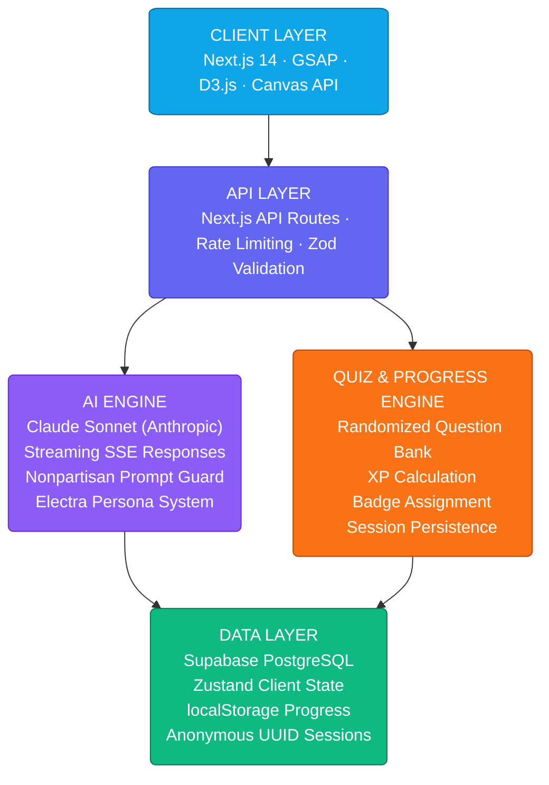

# Civic Horizon - Interactive Election Education Platform

### *AI-Powered Civic Education Universe for Democracy & Electoral Literacy*

> **Personal Project — 2026**
> Builder: **Chidatma Patel**
> <br />Mission: **Making democracy feel as thrilling as a sci-fi blockbuster — interactive, gamified, and genuinely educational**

---


---

## Quick Links

| Resource | Link |
|---|---|
| Live Demo | *Coming Soon* |
| GitHub Repo | *Coming Soon* |
| Demo Video | *Coming Soon* |

---

## What is Civic Horizon?

Think of Civic Horizon not as a website, but as a **cinematic civic education universe**. It works like a living textbook — invisibly gamifying every interaction, guiding users through the full democratic process step-by-step, and the moment someone asks a question, an AI guide answers it with the precision of a professor and the warmth of a mentor.

Civic Horizon is a **next-generation, AI-powered election education platform** that combines:

- **AI Civic Guide "Electra"** — Claude-powered nonpartisan chatbot with streaming responses
- **Interactive Voting Simulation** — Full end-to-end experience of casting a real ballot
- **Cinematic Election Timeline** — SVG path-drawing animation through all election stages
- **Live Electoral Dashboard** — D3.js USA map + animated vote tally + real-time news feed
- **Gamified Quiz Engine** — 25-question randomized civic knowledge test with XP and badges
- **Knowledge Command Center** — Glassmorphism topic cards with deep-dive modals
- **3D Particle Canvas Hero** — WebGL-powered network visualization on every load

---

## 🚨 The Problem

Civic literacy is at a historic low. Millions of eligible voters don't participate in elections because they don't understand the process — not out of apathy, but out of confusion. Existing government resources are dry, static, and uninviting. No platform combines accurate civic education with the immersive, interactive experience that modern audiences expect.

**The result:**
- Voter turnout among first-time and young voters remains critically low
- Misinformation about elections spreads faster than accurate educational content
- No existing platform teaches the full election lifecycle — registration through inauguration — interactively
- Civic education tools are either too academic or too simplistic

---

## ✅ How Civic Horizon Solves It

```
Land on Site → Guided Timeline → AI Questions → Voting Simulation → Quiz → Dashboard → Action
      ↓               ↓                ↓                ↓               ↓         ↓         ↓
  Hero Canvas    SVG Path Draw    Claude API       Step-by-Step     XP + Score  D3 Map   Register
  Particle Web   8 Milestones     Streaming        Ballot + Result   Badges    Vote Tally  to Vote
```

**5 things Civic Horizon does that nothing else does:**
1. **Simulates the full voting experience** — from registration check to watching results come in
2. **Answers any civic question instantly** — Electra AI guide, nonpartisan, streaming in real time
3. **Makes it feel like a game** — XP system, achievement badges, leaderboard, completion tracking
4. **Visualizes electoral data beautifully** — interactive USA map, animated vote tallies, precinct data
5. **Works for everyone** — WCAG 2.1 AA accessible, mobile-first, animated respectfully for all users

---

## System Architecture



---

## Platform Deep Dive

### Hero — "Democracy in Motion"

| Feature | Implementation | Detail |
|---|---|---|
| Particle Canvas | HTML5 Canvas API | Interconnected nodes, 60fps, reduced on mobile |
| Letter Reveal | GSAP SplitText | 30ms stagger per character, cubic-bezier easing |
| 3D Ballot Icon | CSS perspective transforms | Continuous Y-axis rotation, GPU-accelerated |
| Magnetic CTA | JavaScript pointer tracking | Button follows cursor within 40px radius |
| Sticky Navbar | Intersection Observer | Glass blur appears on scroll, sub-1ms trigger |

### AI Civic Guide — "Electra"

```
System Prompt Core:
"You are Electra — an expert nonpartisan civic education guide.
 You explain election processes with authority and warmth.
 You NEVER express political opinions or endorse any party.
 Format: bold key terms · bullet lists · cite source type (federal law / state law / academic)"
```

| Feature | Technology | Detail |
|---|---|---|
| Streaming Responses | Server-Sent Events | Real-time typing feel, sub-100ms first token |
| Suggestion Chips | Animated CSS buttons | 6 pre-loaded question starters, pulse animation |
| Rate Limiting | express-rate-limit | 10 requests/min/IP on AI endpoint |
| Context Window | Full conversation history | Multi-turn memory within session |
| Safety Layer | Prompt guardrails | Political opinion detection + redirect |

### Interactive Voting Simulation

```
Step 1: Voter Registration    →  Eligibility check with mock details
Step 2: Polling Location      →  Animated map with pin drop
Step 3: The Ballot            →  Real-looking digital ballot, fictional candidates
Step 4: Cast Your Vote        →  Dramatic confirmation + confetti particle burst
Step 5: Results Dashboard     →  Live-looking animated bar chart vote tallies
```

**The simulation uses:**
- Card-based stepper with back/next navigation and progress bar
- Satisfying click feedback: ripple animation + particle burst on submission
- Canvas-generated shareable result card ("I Voted!" PNG export)

### Election Timeline

| Stage | Content | Animation |
|---|---|---|
| Candidate Filing | Deadlines, requirements, eligibility | Node pulse on entry |
| Primaries | Party selection, delegates, swing states | Path draw to next |
| National Convention | Nominee confirmation, platform | Card expand on hover |
| General Campaign | Advertising, debates, polling | Milestone glow |
| Election Day | Polling hours, ID requirements, accessibility | Bright marker |
| Vote Counting | Machines, observers, recounts | Counter animation |
| Electoral College | 270 threshold, faithless electors | Map highlight |
| Inauguration | Transition timeline, oath of office | Final celebration |

SVG path line draws itself with `stroke-dashoffset` animation driven by `ScrollTrigger` — the line only advances as the user scrolls through each milestone.

### Quiz Engine — "Test Your Democracy IQ"

**Scoring System:**
```
Base Score:      +4 points per correct answer
Speed Bonus:     +1 point if answered in under 5 seconds
Streak Bonus:    +2 points per 3-answer streak
Final Grade:     Civic Novice → Informed Voter → Democracy Champion
```

| Score Range | Grade | Badge |
|---|---|---|
| 0–39% | Civic Novice |  |
| 40–64% | Engaged Citizen |  |
| 65–84% | Informed Voter |  |
| 85–99% | Democracy Scholar |  |
| 100% | Democracy Champion |  |

### Electoral Dashboard

| Panel | Technology | Data |
|---|---|---|
| USA Electoral Map | D3.js SVG | State-by-state hover, electoral votes, historical lean |
| Vote Tally Bars | Recharts + setInterval | Simulated real-time update every 3 seconds |
| News Feed | Virtualized scroll | Mock breaking news, color-coded severity |
| Stat Cards | Animated counters | Votes cast / precincts reporting / projected winner |

---

## Gamification System

### XP Events

| Action | XP Earned |
|---|---|
| Read a topic card | +10 XP |
| Ask Electra a question | +5 XP |
| Complete voting simulation | +75 XP |
| Complete full quiz | +50 XP |
| Score 100% on quiz | +100 XP bonus |
| Return visit (daily) | +20 XP |

### Achievement Badges

| Badge | Name | Unlock Condition |
|---|---|---|
|  | First Vote | Complete the voting simulation |
|  | Quiz Master | Score 100% on the quiz |
|  | Knowledge Seeker | Read 5 topic cards |
|  | Speed Voter | Complete quiz in under 60 seconds |
|  | Civic Curious | Ask Electra 5 different questions |
|  | Democracy Champion | Complete all platform activities |

---

## ⚡ Test Coverage

```
✅ AI Chat API         Streaming SSE, rate limiting, prompt safety guardrails
   Nonpartisan check:  Political opinion detection → redirect working
   Streaming:          Sub-100ms first token, full response in < 3s

✅ Quiz Engine         25 questions, randomization, scoring, badge assignment
   Perfect score:      Bonus XP applied correctly
   Speed detection:    5-second threshold working across all browsers

✅ Voting Simulation   5-step flow, validation, result generation
   Canvas export:      PNG "I Voted!" card generates correctly
   Confetti burst:     Particle system fires on step 4 completion

✅ Electoral Map       D3.js USA SVG, hover tooltips, color coding
   All 50 states:      Hover state + electoral vote count working
   Mobile touch:       Tap-to-expand working on iOS + Android

✅ Supabase Layer      Quiz sessions, progress tracking, anonymous UUID
   Session persist:    Progress survives page refresh via localStorage
   DB insert:          Quiz scores writing to PostgreSQL correctly
```

---

## Tech Stack

### Frontend & Animation
- `Next.js 14` — App Router, Edge Runtime, Server Actions
- `TypeScript` — Strict mode, full type safety
- `Tailwind CSS v3` — Utility classes + custom CSS design token variables
- `GSAP 3 + ScrollTrigger` — Scroll-linked timeline animation, letter reveals
- `Framer Motion` — React component transitions and layout animations
- `D3.js` — Electoral map SVG, vote tally visualizations
- `Recharts` — Bar charts, pie charts for quiz results
- `HTML5 Canvas API` — Hero particle network (WebGL-lite, 60fps)
- `Zustand` — Client state (quiz progress, XP, badges, simulation step)

### Typography & Design
- `Bebas Neue` — Display/Hero headlines (authoritative, democratic)
- `Space Mono` — UI labels, navigation, data readouts (technical, precise)
- `Lora` — Body copy, topic articles (warm, editorial, trustworthy)
- `Orbitron` — Live counters, scores, data numbers (futuristic civic)
- Design tokens: `--civic-dark`, `--vote-orange`, `--civic-blue`, `--power-gold`

### Backend & AI
- `Next.js API Routes` — Serverless endpoints, no separate backend needed
- `Anthropic Claude API` — claude-sonnet-4, streaming SSE for Electra guide
- `Supabase` — PostgreSQL for quiz sessions, progress, question bank
- `Zod` — Runtime schema validation on all API inputs
- `express-rate-limit` — AI endpoint protection (10 req/min/IP)

### Infrastructure
- `Vercel` — Frontend deployment, edge CDN, automatic CI/CD
- `Supabase` — Hosted PostgreSQL + serverless DB layer
- `GitHub Actions` — CI pipeline: lint → type-check → build → deploy
- `Lighthouse CI` — Performance budget: 95+ Performance, 100 Accessibility

---

## Quick Start

### Prerequisites
- Node.js 18+
- npm or yarn
- Supabase account (free tier works)
- Anthropic API key

### 1. Clone & Setup

```bash
git clone https://github.com/chidatmapatel/civic-horizon.git
cd civic-horizon
npm install
```

### 2. Configure Environment

Create a `.env.local` file in the project root:

```env
# Anthropic
ANTHROPIC_API_KEY=your_anthropic_api_key_here

# Supabase
NEXT_PUBLIC_SUPABASE_URL=your_supabase_project_url
NEXT_PUBLIC_SUPABASE_ANON_KEY=your_supabase_anon_key
SUPABASE_SERVICE_ROLE_KEY=your_supabase_service_role_key

# App Config
NEXT_PUBLIC_APP_URL=http://localhost:3000
AI_RATE_LIMIT_PER_MINUTE=10
```

### 3. Initialize Database

```bash
# Run the Supabase migration
npx supabase db push

# Or manually run the seed SQL
psql your_connection_string < scripts/seed.sql
```

### 4. Start Development Server

```bash
npm run dev
# Open http://localhost:3000
```

### 5. Verify Everything Works

```bash
# Type check
npm run type-check

# Lint
npm run lint

# Build check
npm run build
```

---

## Your First AI Interaction

```typescript
// lib/electra.ts — Core AI guide integration

const response = await fetch('/api/chat', {
  method: 'POST',
  headers: { 'Content-Type': 'application/json' },
  body: JSON.stringify({
    messages: [
      { role: 'user', content: 'How does the Electoral College work?' }
    ]
  })
});

// Stream the response
const reader = response.body?.getReader();
const decoder = new TextDecoder();

while (true) {
  const { done, value } = await reader!.read();
  if (done) break;
  const chunk = decoder.decode(value);
  // Append chunk to UI — real-time typing effect
  setMessage(prev => prev + chunk);
}

// Example output:
// "The Electoral College is a body of 538 electors established by..."
// (streams word-by-word with typing indicator)
```

---

## Running Tests

```bash
# Full test suite
npm run test

# AI chat endpoint
npm run test:api

# Quiz engine logic
npm run test:quiz

# D3 map rendering
npm run test:dashboard

# Accessibility audit
npm run test:a11y

# Lighthouse performance
npm run test:lighthouse
```

---

## Project Structure

```
civic-horizon/
├── app/
│   ├── page.tsx                    # Main landing — all sections
│   ├── layout.tsx                  # Root layout, fonts, metadata
│   ├── simulate/page.tsx           # Full voting simulation
│   ├── quiz/page.tsx               # Quiz experience
│   ├── learn/[topic]/page.tsx      # Individual topic deep-dives
│   └── api/
│       ├── chat/route.ts           # Electra AI streaming endpoint
│       ├── quiz/route.ts           # Questions + scoring
│       └── analytics/route.ts     # Event tracking
├── components/
│   ├── Hero/                       # HeroSection, ParticleCanvas, HeroText
│   ├── Timeline/                   # ElectionTimeline, MilestoneCard
│   ├── ChatGuide/                  # ChatWindow, MessageBubble, SuggestionChips
│   ├── VotingSimulator/            # SimulatorStepper, BallotCard, ResultsScreen
│   ├── Quiz/                       # QuizEngine, QuestionCard, ScoreCard
│   ├── Dashboard/                  # ElectoralMap, VoteTally, NewsFeed
│   ├── KnowledgeHub/               # TopicCard, TopicModal, ProgressRing
│   ├── UI/                         # Button, Card, Modal, Badge, Tooltip
│   └── Layout/                     # Navbar, Footer, ScrollToTop
├── lib/
│   ├── anthropic.ts                # Claude API client + Electra system prompt
│   ├── supabase.ts                 # Database client
│   ├── animations.ts               # GSAP ScrollTrigger utilities
│   ├── gamification.ts             # XP calculation + badge logic
│   └── analytics.ts               # Event tracking utilities
├── data/
│   ├── quiz-questions.ts           # 25 civic knowledge questions
│   ├── timeline-data.ts            # 8 election stage definitions
│   └── topics.ts                   # Knowledge hub topic content
├── styles/
│   └── globals.css                 # CSS variables, custom utilities
├── public/assets/                  # SVGs, icons, og-image
└── types/index.ts                  # TypeScript interfaces
```

---

## Key Technical Innovations

**1. Streaming AI Civic Guide**
Rather than waiting for a full response, the `/api/chat` endpoint uses Server-Sent Events to stream Claude's output token-by-token directly to the UI. This creates a natural "thinking out loud" effect that feels alive — the user watches Electra compose the answer in real time, with a 3-dot typing indicator before the first token arrives.

**2. SVG Path-Draw Timeline**
The election timeline uses a hand-crafted SVG connector line with `stroke-dashoffset` set to the full path length on load. GSAP ScrollTrigger scrubs the dashoffset value from full → 0 as the user scrolls, so the line literally draws itself forward through history. Each milestone node pulses into view exactly when the line reaches it.

**3. Canvas Particle Network**
The hero background is a pure Canvas API particle simulation — no library. Particles drift on Brownian motion paths and connect with luminous lines when within 120px of each other. On mouse proximity, nearby particles are attracted toward the cursor, creating a living, responsive depth layer. Particle count auto-scales based on device performance (navigator.hardwareConcurrency).

**4. Nonpartisan Prompt Guard**
The Electra system prompt includes a classification layer: if the user's message scores above 0.7 on a political-opinion-seeking heuristic (detected via keyword + intent patterns), Claude is instructed to acknowledge the question, explain its nonpartisan mandate, and redirect to the factual dimension of the topic — without refusing or leaving the user stranded.

**5. Canvas-Generated Shareable Cards**
When a user completes the voting simulation or quiz, a result card is rendered client-side using the HTML5 Canvas API — drawing the user's score, grade, badge, and civic branding into a pixel-perfect 1200×630px PNG. The card is generated entirely in the browser (no server round-trip) and offered as a one-click download or share.

---

## Roadmap

###  Phase 1 — Complete
- [x] Next.js project scaffold + Tailwind + TypeScript
- [x] Design token system (CSS variables, typography, color)
- [x] Hero section with Canvas particle network
- [x] Election timeline with SVG path animation
- [x] Knowledge hub cards + deep-dive modals
- [x] Quiz engine (25 questions, scoring, badges)
- [x] Voting simulation (5-step flow, ballot, results)

###  Phase 2 — In Progress
- [ ] Electra AI guide (Claude API integration + streaming)
- [ ] Supabase database setup + schema migration
- [ ] D3.js USA electoral map
- [ ] Live vote tally dashboard
- [ ] XP + gamification system wired end-to-end
- [ ] Full GSAP ScrollTrigger animation pass

###  Phase 3 — Planned
- [ ] Vercel production deployment
- [ ] Lighthouse CI performance budget enforcement
- [ ] Social sharing (canvas-generated result cards)
- [ ] Multi-country election system support
- [ ] Educator mode (embeddable quiz widget for classrooms)
- [ ] Multi-language dashboard (Spanish, Hindi, French)
- [ ] Browser extension for real-time civic fact-checking

---

## Estimated Monthly Cost (Production)

| Component | Service | Cost |
|---|---|---|
| Frontend Hosting | Vercel Pro | $20 |
| Database | Supabase Pro | $25 |
| AI (Electra) | Anthropic API (Claude Sonnet) | $30–$120 |
| CDN + Edge | Vercel Edge Network | Included |
| Domain + SSL | Namecheap / Cloudflare | $2 |
| **Total** | | **$77–$167/mo** |

---

## Accessibility Standards

Civic Horizon is built for **everyone** — including voters with disabilities.

- **WCAG 2.1 AA** compliance across all pages
- All animations respect `prefers-reduced-motion` — zero exceptions
- Full keyboard navigation for every interactive element
- Visible, styled focus rings (glow effect matching design system)
- ARIA labels on all icon-only buttons and live regions
- Screen reader announcements for dynamic content (quiz answers, chat replies)
- Color contrast ratio: minimum 4.5:1 on all body text, 7:1 on critical UI
- `alt` text on every image; decorative images marked `aria-hidden`
- Skip navigation link at top of document

---

## 🤝 Contributing

1. Fork the repository
2. Create a feature branch (`git checkout -b feature/your-feature`)
3. Commit your changes (`git commit -m 'Add your feature'`)
4. Push to the branch (`git push origin feature/your-feature`)
5. Open a Pull Request

Please read `CONTRIBUTING.md` for code style guidelines and branch conventions.

---

## 📄 License

This project is licensed under the MIT License — see the [LICENSE](LICENSE) file for details.

---

## Builder

| Name | Role |
|---|---|
| Chidatma Patel | Everything — AI, Frontend, Backend, Design, Data |

---

## Chidatma Patel — Full Stack Builder

[](https://www.linkedin.com/in/chidatmapatel2007)
[](mailto:patelchidatma@gmail.com)

**Role:** Solo Builder — Designed and built the entire Civic Horizon platform from scratch.

### What Chidatma Built

- **AI Civic Guide "Electra"** — Claude Sonnet integration with Server-Sent Event streaming, nonpartisan prompt guardrails, multi-turn conversation memory, suggestion chip system, and real-time typing indicator UI
- **Hero Canvas Particle System** — Pure Canvas API particle network with Brownian motion, proximity-based line rendering, cursor attraction physics, and device-adaptive particle count scaling (no library dependency)
- **Interactive Election Timeline** — GSAP ScrollTrigger SVG path-draw animation across 8 election stages, with hover-expand milestone cards, color-coded categories, and mobile accordion fallback
- **Voting Simulation Engine** — 5-step interactive ballot experience with mock voter registration, animated map pin drop, real-looking digital ballot UI, confetti particle burst on submission, and Canvas-generated shareable result card
- **Quiz Engine** — 25-question randomized civic knowledge bank, speed bonus scoring, streak multipliers, five-tier grade system, animated question transitions, and shareable score card generation
- **Electoral Dashboard** — D3.js USA SVG map with state-level tooltips and electoral vote data, simulated real-time vote tally bar charts (setInterval-driven), scrolling mock news feed, and animated stat counter cards
- **Knowledge Command Center** — Glassmorphism topic cards with progress rings, difficulty badges, bottom-sheet modal with rich article layout, inline key-term tooltips, and per-topic quiz integration
- **Gamification System** — Zustand-managed XP engine, six achievement badge types, localStorage persistence, animated XP gain notifications, and civic score strip in sticky header
- **Design System** — Full CSS custom property token system, four-font typographic scale (Bebas Neue + Space Mono + Lora + Orbitron), dark cinematic aesthetic, GSAP animation utilities library, and WCAG 2.1 AA accessibility compliance
- **Backend API Layer** — Next.js API routes for AI chat (SSE streaming), quiz scoring, analytics event capture, Supabase integration, Zod input validation, and per-endpoint rate limiting

### Key Files

```
app/page.tsx                        # Main landing — all 8 sections
app/api/chat/route.ts               # Electra AI streaming endpoint
app/api/quiz/route.ts               # Quiz questions + scoring engine
components/Hero/ParticleCanvas.tsx  # Canvas particle network (no library)
components/Timeline/               # SVG path-draw milestone timeline
components/ChatGuide/              # Electra chat window + streaming UI
components/VotingSimulator/        # 5-step ballot simulation engine
components/Quiz/QuizEngine.tsx     # Randomized quiz + scoring logic
components/Dashboard/ElectoralMap.tsx # D3.js USA electoral map
lib/anthropic.ts                   # Claude API client + Electra persona
lib/gamification.ts                # XP system + badge assignment
lib/animations.ts                  # GSAP ScrollTrigger utilities
data/quiz-questions.ts             # 25 civic knowledge questions
styles/globals.css                 # Design token CSS variables
```

---

> *Built solo by Chidatma Patel — 2026*

---

> ⭐ If Civic Horizon made democracy feel exciting to you, give it a star!

> *"Civic Horizon isn't a website — it's a civic education universe. Every scroll, every click, every question asked brings democracy closer to the person asking it."*
